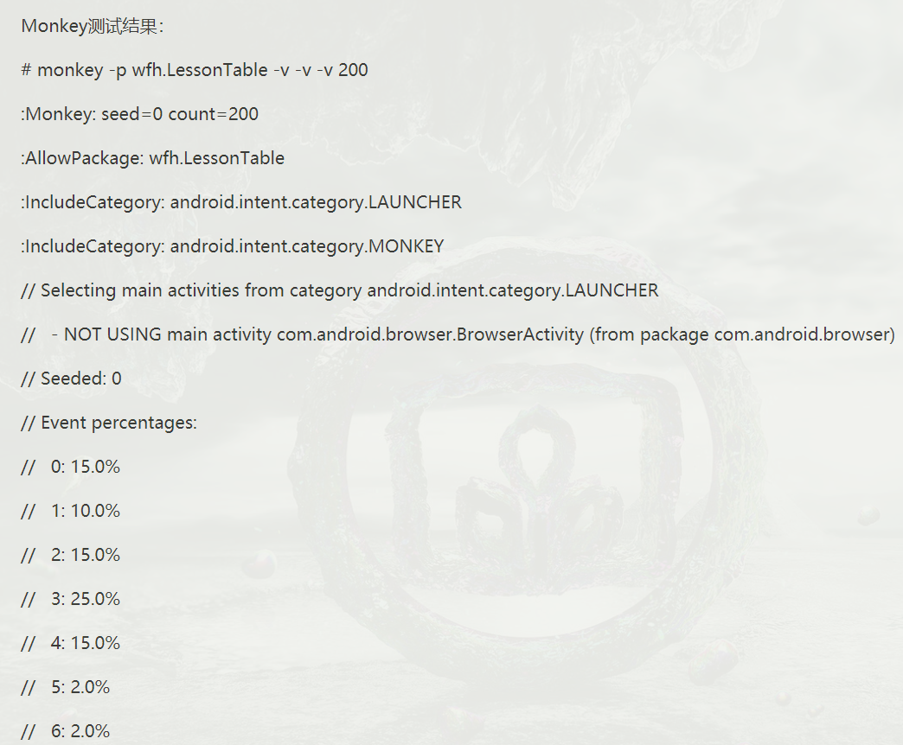
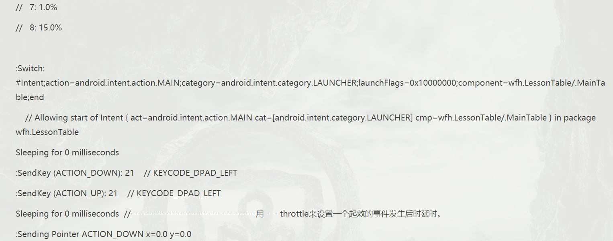
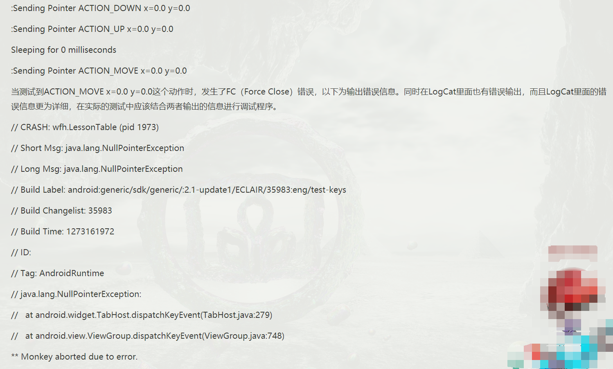
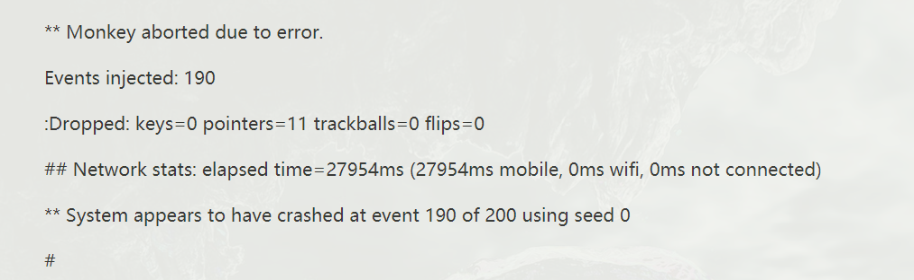
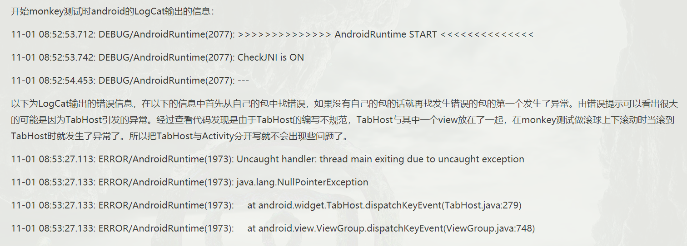
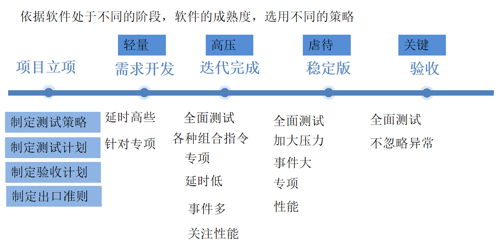

## UI/Application Exerciser Monkey

##### 学习渠道：

官网：https://developer.android.google.cn/studio/test/monkey?hl=zh_cn#basic-use-of-the-monkey
博客：https://www.cnblogs.com/aland-1415/p/6949964.html
课程：C:\Users\32491\Desktop\learn\软件测试方向\移动端自动化测试\PPT   04 Monkey 
实例：喧喧移动端测试

##### 简介：

Monkey是一个在**模拟器或设备**上运行的程序，可生成伪随机用户事件（例如点击、轻触、手势）流以及很多系统级事件。可以使用Monkey以随机且可重复的方式对正在开发的应用进行**压力测试**。

Monkey **命令行工具**   运行在：模拟器实例或设备上
将伪随机用户事件流发送到系统中，从而对正在开发的应用软件进行压力测试

##### 选项：

Monkey包含很多选项：主要为以下四个类别：
（1）基本配置选项，例如设置要尝试的事件数
（2）操作限制条件，例如将测试对象限制为单个软件包
（3）事件类型和频率
（4）调试选项

运行时，monkey会生成事件，并将其发送到系统。它还会监视被测系统并查找三种**特殊情况**：
（1）如果已经将monkey限制为在一个或多个特定软件包中运行，它会监视并阻止转到任何其他软件包的尝试
（2）如果应用崩溃或收到任何未处理的异常，Monkey会停止并报告错误
（3）如果应用生成“应用无响应”错误，Monkey会停止并报告错误
根据选择的详细程度级别，您还将看到有关 Monkey 进度和所生成事件的报告。

##### 关于启动：

monkey启动：**命令行、脚本启动**
由于 Monkey 在模拟器/设备环境中运行，因此您必须从该环境中通过 shell 启动它。为此，您可以在每个命令前面加上 adb shell，或者直接进入 shell 并输入 Monkey 命令。

- adb shell monkey [options] <event-count>
    未指定任何选项，Monkey以默认模式启动，将事件发送到目标上安装的任何软件包

- 启动应用并向其发送500个伪随机事件：
    adb shell monkey -p your.package.name -v 500

##### 命令选项参考信息

可以在monkey命令行中添加的所有选项

###### 常规：

- --help  输出简单的使用指南

- -v   命令行上的每个 -v 都会增加详细程度级别。

    ​	级别 0（默认值）只提供启动通知、测试完成和最终结果。
    ​	级别 1 提供有关测试在运行时的更多详细信息，例如发送到您的 Activity 的各个事件。
    ​	级别 2 提供更详细的设置信息，例如已选择或未选择用于测试的 Activity。

###### 事件：

- -s<seed>   伪随机数生成器的种子值。如果您使用相同的种子值重新运行monkey,它将会生成相同的事件序列。

- --throttle<milliseconds>   在事件之间插入固定延迟时间，使用此选项减慢Monkey速度
- --pct-touch<percent>    调整轻触事件所占百分比。（轻触事件是指屏幕上的单个位置上的按下/释放事件。）
- --pct-motion<percent>    调整动作事件所占百分比。（动作事件包括屏幕上某个位置的按下事件，一系列伪随机动作和一个释放事件。）
- --pct-trackball<percent>    调整轨迹球事件所占百分比。（轨迹球事件包括一个或多个随机动作，有时后跟点击。）
- --pct-nav<percent>   调整“基本”导航事件所占百分比。（导航事件包括向上/向下/向左/向右，作为方向输入设备的输入。）
- --pct-majornav<percent>  调整“主要”导航事件所占百分比。（这些导航事件通常会导致界面中的操作，例如 5 方向键的中间按钮、返回键或菜单键。）
- --pct-syskeys<percent>  调整“系统”按键事件所占百分比。（这些按键通常预留供系统使用，例如“主屏幕”、“返回”、“发起通话”、“结束通话”或“音量控件”。）
- --pct-appswitch<percent> 调整 Activity 启动次数所占百分比。Monkey 会以随机间隔发起 startActivity() 调用，以最大限度地覆盖软件包中的所有 Activity。
- --pct-anyevent<percent>  调整其他类型事件所占百分比。这包括所有其他类型的事件，例如按键、设备上的其他不太常用的按钮等等。
        

###### 约束条件：

- --p <allowed-package-name>   如果您通过这种方式指定一个或多个软件包，Monkey 将仅允许系统访问这些软件包内的 Activity。如果应用需要访问其他软件包中的 Activity（例如选择联系人），您还需要指定这些软件包。如果未指定任何软件包，Monkey 将允许系统启动所有软件包中的 Activity。要指定多个软件包，请多次使用 -p 选项，每个软件包对应一个 -p 选项。
- --c<maincategory>  如果您通过这种方式指定一个或多个类别，Monkey 将仅允许系统访问其中一个指定类别中所列的 Activity。如果没有指定任何类别，Monkey 会选择 Intent.CATEGORY_LAUNCHER 或 Intent.CATEGORY_MONKEY 类别所列的 Activity。要指定多个类别，请多次使用 -c 选项，每个类别对应一个 -c 选项。

###### 调试：

- --dbg-no-events  
              指定后，Monkey 将初始启动到测试 Activity，但不会生成任何其他事件。为了获得最佳结果，请结合使用 -v、一个或多个软件包约束条件以及非零限制，以使 Monkey 运行 30 秒或更长时间。这提供了一个环境，您可以在其中监控应用调用的软件包转换操作。
- --hprof	如果设置此选项，则会在 Monkey 事件序列之前和之后立即生成分析报告。这将在 data/misc 下生成大型（约为 5Mb）文件，因此请谨慎使用。如需了解如何分析性能剖析报告，请参阅剖析应用性能。
- --ignore-crashes	通常，当应用崩溃或遇到任何类型的未处理异常时，Monkey 将会停止。如果指定此选项，Monkey 会继续向系统发送事件，直到计数完成为止。
- --ignore-timeouts	通常，当应用遇到任何类型的超时错误（例如“应用无响应”对话框）时，Monkey 将会停止。如果指定此选项，Monkey 会继续向系统发送事件，直到计数完成为止。
- --ignore-security-exceptions	 通常，当应用遇到任何类型的权限错误（例如，如果它尝试启动需要特定权限的 Activity）时，Monkey 将会停止。如果指定此选项，Monkey 会继续向系统发送事件，直到计数完成为止。
- --kill-process-after-error	通常，当 Monkey 因出错而停止运行时，出现故障的应用将保持运行状态。设置此选项后，它将会指示系统停止发生错误的进程。注意，在正常（成功）完成情况下，已启动的进程不会停止，并且设备仅会处于最终事件之后的最后状态。
- --monitor-native-crashes	监视并报告 Android 系统原生代码中发生的崩溃。如果设置了 
- --kill-process-after-error，系统将会停止。
- --wait-dbg	阻止 Monkey 执行，直到为其连接了调试程序。

##### monkey黑白名单：

黑名单：不测试的应用
白名单：只测试这部分的应用
不能同时设置黑白名单
--pkg-blacklist-file PACKAGE_BLACKLIST_FILE  : apk黑名单，屏蔽掉黑名单中的apk
--pkg-whitelist-file PACKAGE_WHITELIST_FILE ：apk白名单，只测试包含在白名单中的apk

##### 命令参数的实际使用：

- 参数：-p
    指定一个包： adb shell monkey -p  包名 10  （随即操作10次）
    指定多个包： adb shell monkey -p 包名1 -p 包名2 -p 包名3 100
    不指定包：adb shell monkey 100

- 参数：-v（日志）

    日志级别Level 0：adb shell monkey -p 包名 -v 100

    日志级别Level 1：adb shell monkey -p 包名 -v -v 100

    日志级别Level 2：adb shell monkey -p 包名 -v -v -v 100

- 参数：-s

    adb  shell monkey -p 包名 -s 10 100 运行两次，测试效果相同

- 参数：--throttle<毫秒>  延时

    adb shell monkey -p 包名 --throttle 5000 100

- 参数：--ignore-crashes

    adb shell monkey -p 包名 --ignore-crashes 1000

    测试过程中即使程序崩溃，Monkey依然会继续发送事件直到事件数目达到1000为止

    adb shell monkey -p 包名 1000

    测试过程中，如果acg程序崩溃，Monkey将会停止运行

- 参数：--ignore-timeouts  ANR (application no responding)

    adb shell monkey -p 包名 --ignore-timeouts 1000

- 参数：--ignore-security-exceptions  许可错误

    adb shell monkey -p 包名 --ignore-security-exception 1000

    exception有没有s ？？

- 参数：--kill-process-after-error  应用程序

    adb shell monkey -p 包名 --kill-process-after-error 1000

- 参数：--monitor-native-crashes  监视并报告

    adb shell monkey -p 包名 --monitor-native-crashes 1000

- 参数：--pct-{+事件类别}{+事件类别百分比}

- 参数：--pct-touch{+百分比}  触摸事件百分比

    adb shell monkey -p 包名 --pct-touch 10 1000

- 参数：--pct-motion{+百分比}  动作事件

    adb shell monkey -p 包名 --pct-motion 20 1000

- 参数：--pct-trackball{+百分比}  轨迹事件

    adb shell monkey -p 包名 --pct-trackball 30 1000

- 参数：--pct-nav{+百分比}   导航事件

    adb shell monkey -p 包名 --pct-nav 40 1000

- 参数：--pct-majornav{+百分比} 主要导航事件

    adb shell monkey -p 包名 --pct-majornav 50 1000

##### 输出monkeylog：

C:\Documents and Settings\Administrator>adb shell monkey -p 包名

 -v 300  >e:\text.txt

##### monkey测试结果分析：

###### 一、初步分析方法

1. 找到monkey出错位置
2. 查看monkey里面出错前的一些事件动作，并手动执行该动作
3. 若以上步骤还不能找出，可以使用之前执行的monkey命令再执行一遍，注意seed值要一样--复现

一般的测试结果分析：

1、 ANR问题：在日志中搜索“ANR”

​	   Application Not Responding，在Android上，如果应用有一段时间不够灵敏，系统会向用户显示一个对话框。“强制关闭或等待”。

2、崩溃问题：在日志中搜索“Exception” Force Close

###### 二、详细分析monkey日志

log的最开始会显示Monkey执行的seed值、执行次数和测试的包名

首先需要查看Monkey测试中是否出现了ANR或者异常

分析log中的具体信息，方法如下：

- 查看log中第一个Switch，主要是查看Monkey执行的是哪一个Activity，在下一个swtich之间的，如果出现了崩溃或其他异常，可以在该Activity中查找问题的所在。

- Sending Pointer ACTION_DOWN和Sending Pointer ACTION_UP代表当前执行了一个单击的操作

- **Sleeping for 500 milliseconds**这句log是执行Monkey测试时，throttle设定的间隔时间，每出现一次，就代表一个事件。

- SendKey(ACTION_DOWN) //KEYCODE_DPAD_DOWN 代表当前执行了一个点击下导航键的操作；

- Sending Pointer ACTION_MOVE 代表当前执行了一个滑动界面的操作。

- 如果Monkey测试顺利执行完成，在log的最后，会打印出当前执行事件的次数和所花费的时间；// Monkey finished代表执行完成。Monkey执行中断，在log的最后也能查看到当前已执行的次数。

- 正常跑完事件：

    Events injected: 6000

    :Dropped: keys=0 pointers=9 trackballs=0 flips=0

    \## Network stats: elapsed time=808384ms (0ms mobile, 808384ms wifi, 0msnot connected)

    // Monkey finished

- 遇到异常结束：
    ** **Monkey aborted due to error**.
    Events injected: 1744
    :Sending rotation degree=0, persist=false
    :Dropped: keys=3 pointers=8 trackballs=0 flips=0 rotations=0
    井井 Network stats: elapsed time=55269ms (0ms mobile, 0ms wifi, 55269ms not connected)
    ** System appears to have crashed at event 1744 of 10000 using seed 1435753466327

##### 范例：

monkey测试logcat输出信息：

在monkey测试中**常用的命令组合**有：

1、monkey -p com.yourpackage -v 500／／简单的输出测试的信息。

2、monkey -p com.yourpackage -v -v  500 //以深度为二级输出测试信息。

4、monkey -p com.yourpackage -s 数字 -v 500／／为随机数的事件序列定一个值，若出现问题下次可以重复同样的系列进行排错。

5、monkey -p com.yourpackage -v --throttle 3000 500//为每一次执行一次有效的事件后休眠3000毫秒。

##### Monkey测试策略：

- 策略例子1：整机测试，而不测试拨号应用，忽略所有错误，次数100万次
    adb shell monkey --ignore-crashes --ignore-timeouts --pkg-blacklist-file /data/local/tmp/blacklist.txt -v -v 1000000
- 策略例子2：测试计算器30万次，随机种子为100，随机延迟0-1秒，忽略所有错误
    adb shell monkey  -p com.android.calculator2  -s 100 --throttle 1000 --randomize-throttle --ignore-crashes --ignore-timeouts -v -v 300000
- 策略例子3：测试计算器，触摸事件30%，其他按键50%，错误停止，延时200
    adb shell monkey -p com.android.calculator2 --throttle 200 --pct-touch 30 --pct-anyevent 50 -v -v 100000
- 策略例子4：对计算器进行旋转压力测试，事件延时2秒,10万次
    adb shell monkey -p com.android.calculator2 --pct-rotation 100 --throttle 2000 100000
- 策略例子5：仅对整机的应用开启测试,事件延时5秒,10万次
    adb shell monkey --pct-appswitch 100 --throttle 5000 100000

##### Monkey综合应用：

- 命令的组合：

    应用选取策略+随机种子策略+事件策略+异常策略+延时策略+事件数量

- 应用选取策略：

    1、单应用
    2、多应用组合
    3、黑白名单组合
    4、整机测试

- 随机种子策略：

    1、固定种子，从小到极大的种子
    2、随机种子

- 事件策略：

    1、用户故事策略：依据常见的用户场景划分各事件百分比
    2、应用特性策略：依据应用策略对Monkey各事件进行划分百分比
    3、专项测试策略：对某个事件提高到很高的百分比，对应用进行专项测试

- 异常策略：

    1、跑完：全部异常忽略
    2、专门测试某个异常出现：不忽略某个异常，出现某个异常即停止测试
    3、人在时候：上班过程中跑不忽略异常，出现异常马上停止，可以马上分析
    4、验收策略：去除全部异常，出现错误则停止，则验收不通过

- 延时策略：
    1、低延时
    2、高延时
    3、随机延时
    4、用户操作延时
-  事件数量
    1、常规测试：10万
    2、压力型测试：30万
    3、稳定性测试：50万
    4、长时间执行：100万

##### 如何确定被测应用的包名：

- 方式一：问开发
- 方式二：uiautomatorviewer.bat
    查看AppData\Local\Android\sdk\tools
- 方式三：aapt dump badging d:\group-612_0-meituan.apk | findstr launchable-activity
- 方式四： adb logcat|findstr START

##### Monkey脚本 

- 待补充

讲授？

为什么要这样应用？

com.cnezsoft.xxm/.MainActivity